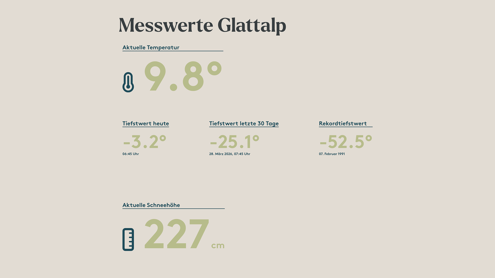
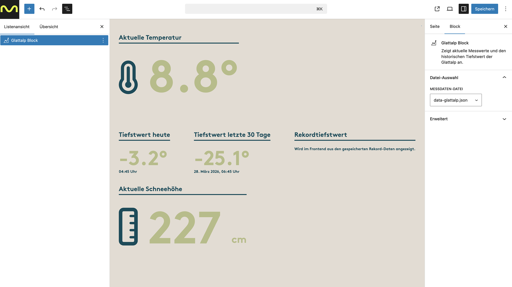

# UD Block: Glattalp Block

Der Glattalp Block zeigt aktuelle Messwerte der Glattalp auf Basis einer JSON-Datei an.

Ausgegeben werden die aktuelle Temperatur, die aktuelle Schneehöhe sowie definierte Tiefstwerte. Die Verarbeitung erfolgt serverseitig über PHP.

## Funktionen

* Anzeige der aktuellen Temperatur
* Anzeige der aktuellen Schneehöhe
* Anzeige des Tiefstwerts des aktuellen Tages
* Anzeige des Tiefstwerts der letzten 30 Tage
* Anzeige eines Rekordtiefstwerts aus WordPress-Optionen
* Auswahl einer JSON-Datei über einen eigenen REST-API-Endpunkt
* Server-Side Rendering im Frontend

## Screenshots


*Darstellung der Messstation mit aktuellen Werten.*


*Der Block im Editor mit Auswahlfeld für die JSON-Datei und sichtbaren Messwerten.*

## Datenquelle

Standardmässig wird folgende Datei verwendet: `/wp-content/messdaten/data-glattalp.json`

Die JSON-Datei enthält ein Array von Messpunkten. Jeder Eintrag besteht aus einem Zeitstempel sowie den Messwerten für Temperatur und Schneehöhe.


```json
[
  {
    "time": "2026-02-27T15:35:01",
    "Aussentemperatur_Glattalp_C": 4.5,
    "Schneehoehe_Glattalp_cm": 176
  },
  {
    "time": "2026-02-27T15:40:01",
    "Aussentemperatur_Glattalp_C": 4.3,
    "Schneehoehe_Glattalp_cm": 176
  }
]
```

## Block-Attribute

`dataUrl` Pfad zur JSON-Datei

`temperatureKey` Key für den Temperaturwert innerhalb der JSON-Daten

`snowKey` Key für die Schneehöhe innerhalb der JSON-Daten

## REST API

Endpoint: `/wp-json/ud/glattalp/scan-json`

Listet alle JSON-Dateien im Verzeichnis `/wp-content/messdaten/` auf.


## Rendering

Die Ausgabe erfolgt serverseitig.

Berechnet werden:

* aktuelle Temperatur
* aktuelle Schneehöhe
* Tiefstwert heute
* Tiefstwert der letzten 30 Tage
* Rekordwert aus WordPress-Optionen


## Anforderungen

* WordPress 6.5+
* PHP 8.0+

## Hinweise

Die JSON-Daten werden lokal eingelesen.
Fehlerhafte oder fehlende Dateien werden im Frontend angezeigt.

## Autor

ulrich.digital gmbh
[https://ulrich.digital](https://ulrich.digital)

## Lizenz

GPL v2 or later
[https://www.gnu.org/licenses/gpl-2.0.html](https://www.gnu.org/licenses/gpl-2.0.html)

